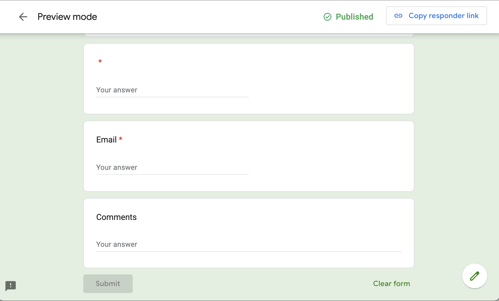
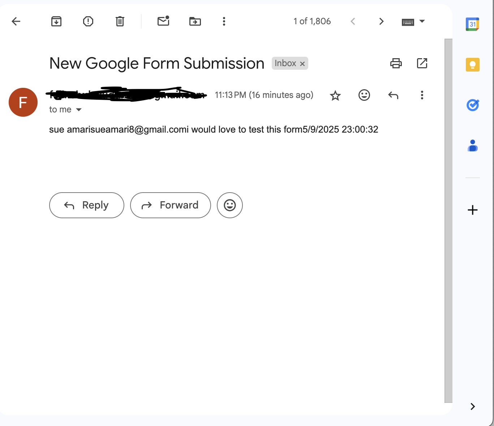

# zap-email-notifications
Automatically sends email notifications when a Google Form is filled out using Zapier.

# zap-email-notifications

## 🚀 Overview

This project automates the process of sending email notifications whenever a user fills out a **Google Form**. Using **Zapier**, the form submissions trigger an **email alert** that provides the form responses.

This is a simple yet powerful automation to keep track of new form submissions in real time.

## 🔧 Tools Used

- **Google Forms** – Collects responses from users.
- **Google Sheets** – Stores form submissions automatically.
- **Zapier** – Automates the process of sending email notifications.
- **Gmail** – Sends the email notification with form details.

## ⚙️ How It Works

1. A user fills out the **Google Form**.
2. The responses are automatically saved into a **Google Sheet** linked to the form.
3. **Zapier** detects when a new row is added to the sheet (i.e., a new form submission).
4. Zapier triggers a **Gmail email notification** with the form details.

---

## 🧪 Sample Email

When you receive the email, it will look something like this:

Subject: New Google Form Submission!

Body:
You just got a new form response!

Name: John Doe
Email: john.doe@example.com
Message: I'm interested in your services!

## 📸 Screenshots

### **Google Form Setup**

This is the form that collects responses. It is linked to the Google Sheet for storage.

### **Zapier Trigger Setup**

Here, we set up Zapier to monitor the Google Sheet for new form submissions.

### **Test Email**

This is an example of the email you receive when a new form submission happens.

---

---

## 📌 Notes

- The **Google Form** is automatically connected to a **Google Sheet** where all responses are saved.
- **Zapier** listens for new rows in the Google Sheet (i.e., when someone submits the form).
- **Gmail** sends an email notification with the form details when a new submission occurs.
- This setup uses **Zapier’s free plan**, but you can upgrade for more advanced features.
- You can modify the Zap to perform additional actions, like sending a Slack message or saving the data to a CRM.

---

## 📥 Setup Instructions

Follow these steps to recreate this project:

1. **Create a Google Form** with fields like Name, Email, and Message.
2. Link the Google Form to a **Google Sheet** (this is done automatically by Google Forms).
3. **Create a Zap** in **Zapier**:
   - Set the trigger to be a new row in the Google Sheet.
   - Set the action to send an email via **Gmail** with the form responses.
4. **Turn on the Zap** to start receiving email notifications.
5. Optionally, add a demo video showing the process.

